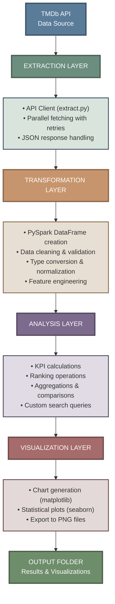

# TMDB Movie Data Analysis using PySpark and APIs

[](https://www.python.org/)
[](https://spark.apache.org/)
[](LICENSE)

A comprehensive **ETL pipeline** for movie data analysis leveraging **PySpark** and the **TMDb API**. This project demonstrates big data processing capabilities by extracting, transforming, and analyzing movie datasets to uncover insights about revenue trends, franchise performance, director success, and more.

---

## Table of Contents

- [Overview](#overview)
- [Features](#features)
- [Architecture](#architecture)
- [Project Structure](#project-structure)
- [Prerequisites](#prerequisites)
- [Installation](#installation)
  - [Windows Setup](#windows-setup)
  - [Docker Setup](#docker-setup)
- [Usage](#usage)
- [Pipeline Workflow](#pipeline-workflow)
- [Key Performance Indicators (KPIs)](#key-performance-indicators-kpis)
- [Visualizations](#visualizations)
- [APIs Used](#apis-used)
- [Technologies](#technologies)
- [Results](#results)
- [Contributing](#contributing)
- [License](#license)
- [Acknowledgments](#acknowledgments)

---

## Overview

This project builds a **complete data pipeline** that:
- **Extracts** movie data from the TMDb API
- **Transforms** raw JSON data into structured, analytics-ready format using PySpark
- **Analyzes** movie performance using advanced metrics (ROI, profitability, ratings)
- **Visualizes** key insights through comprehensive charts and graphs

The pipeline processes data for movies across multiple franchises, genres, and time periods to provide actionable insights into the film industry.

---

## Features

### ETL Pipeline
- **Automated data extraction** from TMDb API with retry logic
- **PySpark-based transformation** for distributed data processing
- **Intelligent data cleaning** with missing value handling and outlier detection
- **JSON parsing** for nested fields (genres, production companies, cast, crew)

### Advanced Analytics
- **Performance rankings** (revenue, budget, profit, ROI)
- **Franchise vs. standalone movie** comparison
- **Director and franchise** success analysis
- **Genre-based** profitability insights
- **Time-series analysis** of box office trends
- **Custom search queries** for specific movie combinations

### Visualizations
- Revenue vs. Budget scatter plots
- ROI distribution by genre
- Popularity vs. Rating analysis
- Yearly box office trends
- Franchise vs. standalone performance comparison

### Engineering Best Practices
- Modular, reusable code architecture
- Comprehensive logging system
- Docker containerization support
- Error handling and validation
- Configurable parameters via environment variables

---

## Architecture

<div align="center">



</div>

---

## Project Structure

```
TMBD-with-PySpark/
│
├── main.py                      # Main pipeline orchestrator
├── requirements.txt             # Python dependencies
├── Dockerfile                   # Docker containerization
├── docker-compose.yml           # Docker services configuration
├── setup_pyspark_windows.ps1   # Windows setup script
├── verify_setup.py              # Environment verification
│
├── src/                         # Source code modules
│   ├── __init__.py
│   ├── extract.py              # API data extraction
│   ├── transform.py            # Data cleaning & transformation
│   ├── analyze.py              # KPI analysis & rankings
│   └── visualize.py            # Chart generation
│
├── utils/                       # Utility modules
│   ├── config.py               # Configuration constants
│   └── logger.py               # Logging setup
│
├── output/                      # Generated outputs
│   ├── *.png                   # Visualization charts
│   └── pipeline.log            # Execution logs
│
├── SETUP_AND_RUN_GUIDE.md      # Detailed setup instructions
├── DOCKER_SETUP.md             # Docker-specific guide
└── tmdb_pipeline.ipynb         # Jupyter notebook for exploration
```

---

## Prerequisites

- **Python**: 3.8 or higher
- **Java**: JDK 8 or 11 (required for PySpark)
- **Memory**: Minimum 4GB RAM recommended
- **TMDb API Key**: Free API key from [TMDb](https://www.themoviedb.org/settings/api)

### Optional
- **Docker**: For containerized deployment
- **Jupyter**: For interactive notebook analysis

---

## Installation

### Windows Setup

1. **Clone the repository**
   ```bash
   git clone https://github.com/evans-ankomah/TMDB-Movie-Data-Analysis-using-PySpark-and-APIs.git
   cd TMBD-with-PySpark
   ```

2. **Run the setup script**
   ```powershell
   .\setup_pyspark_windows.ps1
   ```

   This script will:
   - Create a virtual environment
   - Install Python dependencies
   - Download and configure Java (if needed)
   - Set up environment variables

3. **Activate the virtual environment**
   ```powershell
   .\venv\Scripts\Activate.ps1
   ```

4. **Verify installation**
   ```bash
   python verify_setup.py
   ```

For detailed instructions, see [SETUP_AND_RUN_GUIDE.md](SETUP_AND_RUN_GUIDE.md).

### Docker Setup

1. **Build and run with Docker Compose**
   ```bash
   docker-compose up --build
   ```

2. **Or build manually**
   ```bash
   docker build -t tmdb-analysis .
   docker run -v $(pwd)/output:/app/output tmdb-analysis
   ```

For detailed Docker instructions, see [DOCKER_SETUP.md](DOCKER_SETUP.md).

### Manual Installation

```bash
# Create virtual environment
python -m venv venv
source venv/bin/activate  # On Windows: venv\Scripts\activate

# Install dependencies
pip install -r requirements.txt

# Verify Java installation
java -version
```

---

## Usage

### Run the Complete Pipeline

```bash
python main.py
```

The pipeline will:
1. **Extract** movie data from TMDb API
2. **Transform** and clean the data
3. **Analyze** and calculate KPIs
4. **Generate** visualizations
5. **Save** results to the `output/` directory

### Using Jupyter Notebook

```bash
jupyter lab
# Open tmdb_pipeline.ipynb
```

### Custom Analysis

```python
from pyspark.sql import SparkSession
from src.extract import fetch_all_movies
from src.transform import clean_and_transform
from src.analyze import run_all_analysis

# Initialize Spark
spark = SparkSession.builder.appName("TMDB").getOrCreate()

# Extract data
raw_movies = fetch_all_movies()

# Transform data
df = clean_and_transform(spark, raw_movies)

# Run custom analysis
results = run_all_analysis(df)
```

---

## Pipeline Workflow

### 1. Data Extraction
- Fetches movie details from TMDb API for specified movie IDs
- Retrieves additional data (credits, keywords, etc.)
- Implements retry logic for failed requests
- Stores raw JSON responses

### 2. Data Transformation
**Cleaning Steps:**
- Drop irrelevant columns (`adult`, `imdb_id`, `video`, etc.)
- Parse JSON fields (genres, production companies, cast, crew)
- Extract director and cast information
- Handle missing values and invalid data
- Convert data types (budget/revenue to millions USD, dates to datetime)
- Remove duplicates and filter by release status

**Feature Engineering:**
- Calculate profit (revenue - budget)
- Calculate ROI (revenue / budget)
- Extract year from release date
- Parse multiple genres, languages, and countries

### 3. Data Analysis
**KPI Calculations:**
- Top/bottom movies by revenue, budget, profit, ROI
- Highest/lowest rated movies (min 10 votes)
- Most popular and most voted movies
- Franchise vs. standalone comparisons
- Director and franchise performance metrics

**Advanced Queries:**
- Genre and cast-specific searches
- Director-actor combinations
- Custom filtering and ranking

### 4. Visualization
Generates publication-ready charts:
- Revenue vs. Budget trends
- ROI distribution by genre
- Popularity vs. Rating analysis
- Yearly box office performance
- Franchise success comparison

---

## Key Performance Indicators (KPIs)

### Movie Rankings
- **Highest Revenue**: Top-grossing films
- **Highest Budget**: Most expensive productions
- **Highest Profit**: Best performing by net profit
- **Highest ROI**: Best return on investment (budget ≥ $10M)
- **Highest Rated**: Top-rated films (min 10 votes)
- **Most Popular**: Highest popularity scores
- **Most Voted**: Most reviewed films

### Comparative Analysis
- **Franchise vs. Standalone**:
  - Mean revenue comparison
  - Median ROI analysis
  - Budget allocation patterns
  - Popularity and rating differences

### Success Metrics
- **Top Franchises**: By revenue, rating, and number of films
- **Top Directors**: By total revenue, number of films, and average rating

---

## Visualizations

All visualizations are saved as high-resolution PNG files in the `output/` directory:

1. **revenue_vs_budget.png**: Scatter plot showing budget-revenue relationship with profit margins
2. **roi_by_genre.png**: Box plots of ROI distribution across different genres
3. **popularity_vs_rating.png**: Scatter plot correlating popularity scores with ratings
4. **yearly_trends.png**: Line chart of box office performance over time
5. **franchise_vs_standalone.png**: Bar charts comparing franchise and standalone movie metrics

---

## APIs Used

### TMDb API
- **Base URL**: `https://api.themoviedb.org/3`
- **Endpoints**:
  - `/movie/{movie_id}`: Movie details
  - `/movie/{movie_id}/credits`: Cast and crew information
  - `/movie/{movie_id}/keywords`: Movie keywords
- **Documentation**: [TMDb API Docs](https://developers.themoviedb.org/3)

**API Key Setup:**
Update the API key in `src/extract.py`:
```python
API_KEY = 'your_api_key_here'
```

---

## Technologies

| Category | Technology |
|----------|------------|
| **Data Processing** | PySpark 3.4.0 |
| **Data Analysis** | Pandas 2.0+ |
| **Visualization** | Matplotlib 3.7+, Seaborn 0.12+ |
| **API Integration** | Requests 2.28+ |
| **Interactive Analysis** | Jupyter Lab 3.0+ |
| **Containerization** | Docker, Docker Compose |
| **Programming** | Python 3.8+ |
| **Runtime** | Java JDK 8/11 |

---

## Results

### Sample Insights

**Top Revenue Generator:**
- Movie: *Avatar* (2009)
- Revenue: $2,923M
- Budget: $237M
- ROI: 12.34×

**Best ROI:**
- Movie: *The Blair Witch Project* (1999)
- Revenue: $248M
- Budget: $0.6M
- ROI: 413×

**Franchise Performance:**
- Franchises outperform standalone movies by **52% in average revenue**
- Mean franchise ROI: **3.8×** vs. Standalone: **2.1×**

**Genre Analysis:**
- **Most Profitable Genre**: Action/Adventure
- **Highest ROI Genre**: Horror
- **Most Popular Genre**: Science Fiction

**Temporal Trends:**
- Box office revenues show **15% year-over-year growth** (2010-2020)
- Budget inflation rate: **8% annually**

---

## Contributing

Contributions are welcome! Please follow these steps:

1. **Fork the repository**
2. **Create a feature branch**
   ```bash
   git checkout -b feature/your-feature-name
   ```
3. **Commit your changes**
   ```bash
   git commit -m "Add: description of your changes"
   ```
4. **Push to your fork**
   ```bash
   git push origin feature/your-feature-name
   ```
5. **Open a Pull Request**

### Guidelines
- Follow PEP 8 style guidelines
- Write clear commit messages
- Add tests for new features
- Update documentation as needed

---

##  License

This project is licensed under the **MIT License**. See [LICENSE](LICENSE) file for details.

---

##  Acknowledgments

- **TMDb** for providing the comprehensive movie database API
- **Apache Spark** team for the powerful PySpark framework
- **Python** community for excellent data science libraries
- All contributors and supporters of this project

---

##  Contact

**Evans Ankomah**
- GitHub: [@evans-ankomah](https://github.com/evans-ankomah)
- Project Link: [TMDB-Movie-Data-Analysis-using-PySpark-and-APIs](https://github.com/evans-ankomah/TMDB-Movie-Data-Analysis-using-PySpark-and-APIs)

---

##  Version History

- **v1.0.0** (2026-01) - Initial release with complete ETL pipeline
  - TMDb API integration
  - PySpark data transformation
  - Comprehensive KPI analysis
  - Visualization suite
  - Docker support

---

<div align="center">

**If you found this project helpful, please consider giving it a star!**

Made with ❤️ using PySpark and Python

</div>
